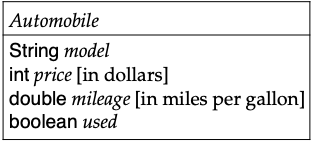

# Homework 1 - Simple Data Definitions in Java

Generally speaking, you will code all your homework assignments in Eclipse. Create a separate "Java Project" your Eclipse workspace for each assignment (name them as specified at the top of each assignment). To submit an assignment, right-click on the "src" folder of the project; choose "Show In --> System Explorer". This should open up to the "src' directory/folder in Windows File Explorer/Mac OS Finder. Go into the "src", select all the relevant Java files and upload/copy them to your shared submission directory.

For this assignment, create a project named `hw01-simple-classes` in Eclipse.


## Tasks

1. Create a class that captures *students*. Each student has a first name, last name, class year, and major. Create two examples of students.

---
2. Create a class that captures *planets*. Each planet has a name, a distance from the sun, and its gravity relative to Earth’s gravity. For distance and gravity, use the type double which captures real numbers. As examples, make instances for Earth and your favorite non-earth planet.

---
3. Translate the class diagram below into a class definition. Create instances of the class as examples.

    

---
4. Consider the following context:

    > . . . Develop a program that creates a gallery from image descriptions that specify the height, width, and name of a source file, plus some additional information about their quality. . . .

    Critique the following class definition. Copy the code into your Eclipse workspace and make any modifications. Put a block comment at the bottom of the file listing what you modified and why.

    ```
    // represents a computer image file
    class Image {
        int height;
        int width;
        String source;
        String quality;
        
        Image(int width, int height, String quality) {
            this.height = height;
            this.width = width;
            this.quality = quality;
        }
    }
    ```

---
5. *[If you took CSC 225 last year, you may skip this one if you want.]*<br>
    Design a data representation (name your class `Rational`) for rational numbers that will support addition, subtraction, multiplication, and division. A rational number has a **numerator** and a **denominator**.

    Don't forget a `Test` class with a variety of examples.
